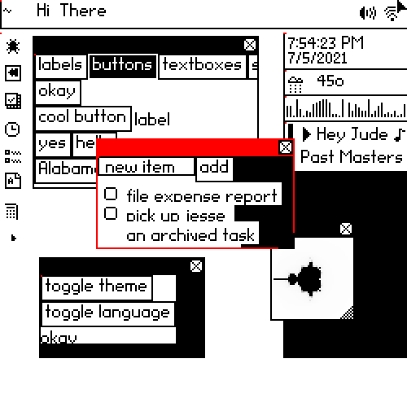

This repo contains a prototype of the bottom half of IdealOS, a theoretical desktop operating system that builds
on the lessons of the past and tries to implement a full system in 1% of the code. This repo
contains the graphics and input layers up through debugging tools and some simple proof of concept apps.
Currently it runs on Mac, but should work on anything supported by SDL2 that can run NodeJS and the Rust compiler.  Right now it runs in a window on top of your existing OS.

The purpose of this prototype is to experiment with desktop OS ideas. How can we provide 
functionality modern people expect with 1% of the code and at many times the speed (or on meager
hardware like a Raspberry PI).



## Achitecture

The OS is built around message passing. The core server stores a tiny bit of state and routes
JSON messages around with websockets. Apps are little headless processes that connect to the
server on launch and perform all interaction with messages: (drawing, input, storage).  The display
server is the only component that talks to the actual hardware. It draws to the screen and
handles mouse and keyboard input. 

The APIs are designed to support multiple implementations. Currently the core server and apps 
are written in Javascript, while the display server is written in Rust. There is also a separate
display implementation in browser Javascript [as part of the debugger](https://github.com/joshmarinacci/idealos_sidecar).

The actual schema for supported messages [is in a separate repo](https://github.com/joshmarinacci/idealos_schemas), along with generated Javascript
and Rust bindings to those messages.

## Steps to Run

### Preparation
* you should already have [NodeJS installed](https://nodejs.org/en/)
  * if on Raspberry Pi 3/4/400 do:
```shell
 sudo apt update
 sudo apt full-upgrade -y
 curl -sL https://deb.nodesource.com/setup_16.x | sudo -E bash -
 sudo apt update
 sudo apt install -y nodejs
 sudo apt-get install gcc g++ make
 
```
* You should already have git installed. on Pi do:
```shell
sudo apt-get install git
```

### Core OS
* clone [this repo](https://github.com/joshmarinacci/idealos_bottom) (idealos_bottom) 
* install deps with `cd idealos_bottom; npm install;`
* run the main server and default apps with `npm run start-server`

### Sidecar
For the Sidecar renderer that uses your webbrowser do
in another terminal window do:
  * clone the [testing display server repo](https://github.com/joshmarinacci/idealos_sidecar)
  * install deps with `npm install`
  * run the display server with `npm start`
  * it will compile then open your browser with a page. press the 'connect' button to connect to the server.

### Native (no X windows) renderer 

* install [rustup](https://www.rust-lang.org/tools/install) 
  * on a recent Rpi you can do: `curl --proto '=https' --tlsv1.2 -sSf https://sh.rustup.rs | sh` and accept the defaults. You might need to log out and back into the shell to get `cargo` in your path.
* clone the [rust display server repo](https://github.com/joshmarinacci/idealos_rust_client)
* build it with `cd idealos_rust_client; cargo run;`
* If it fails with an openssl error, install libssl-dev first (I had to do this on Raspberry Pi) `sudo apt-get install libssl-dev` then run `cargo run` again.
* You might also need to install SDL. `sudo apt-get install libsdl2-dev`  then run `cargo run` again.
* now run the client gui with `cargo run ws://localhost:8081`

