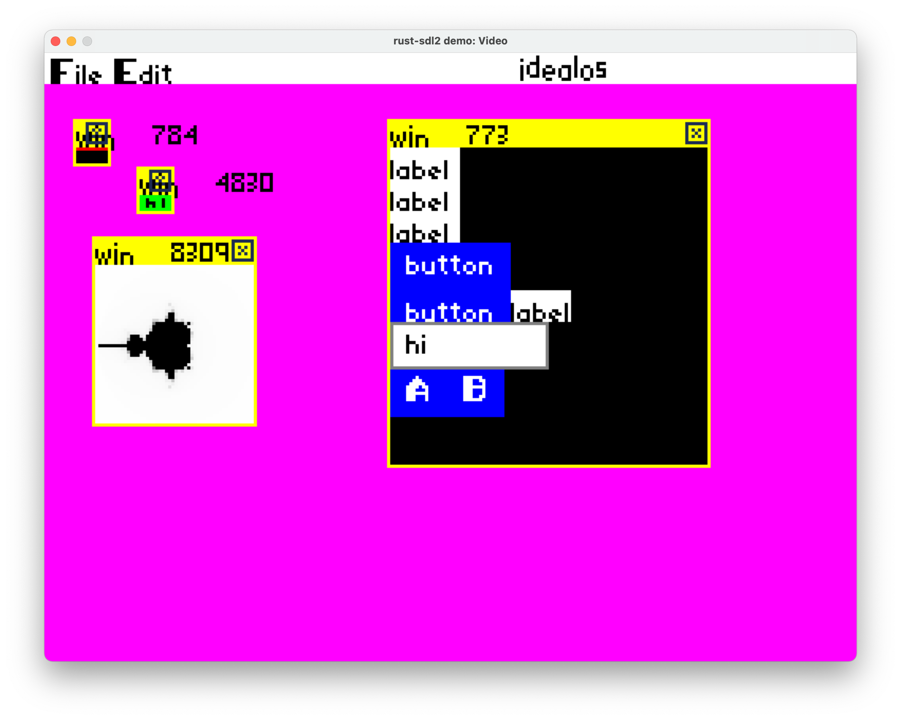

This repo contains a prototype of the bottom half of IdealOS, a theoretical desktop operating system that builds
on the lessons of the past and tries to implement a full system in 1% of the code. This repo
contains the graphics and input layers up through debugging tools and some simple proof of concept apps.
Currently it runs on Mac, but should work on anything supported by SDL2 that can run NodeJS and the Rust compiler.  Right now it runs in a window on top of your existing OS.

The purpose of this prototype is to experiment with desktop OS ideas. How can we provide 
functionality modern people expect with 1% of the code and at many times the speed (or on meager
hardware like a Raspberry PI).

## Achitecture

The OS is built around message passing. The core server stores a tiny bit of state and routes
JSON messages around with websockets. Apps are little headless processes that connect to the
server on launch and perform all interaction with messages: (drawing, input, storage).  The display
server is the only component that talks to the actual hardware. It draws to the screen and
handles mouse and keyboard input. 

The APIs are designed to support multiple implementations. Currently the core server and apps 
are written in Javascript, while the display server is written in Rust. There is also a separate
display implementation in browser Javascript in a separate repo as part of the debugger.

The actual schema for supported messages is in a separate repo, along with generated Javascript
and Rust bindings to those messages.

## Steps to Run

* make sure you have SDL2 installed on your machine already.
* make sure you have cargo and rust installed already. 
* check out the code with git
* install deps with `npm install`
* run the main server and default apps with `npm run start-server`
* run the rust display server `npm run rust`
* if all goes well, you'll see some overlapped windows. You can drag them around
by the titlebar and click on buttons in one of the apps. Another app will slowly
  draw a mandlebrot fractal.
* press 'escape' in the display app to quit (or just ^C everything)
