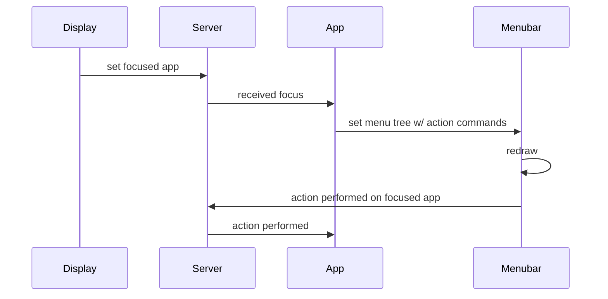

There is the concept of a focused app. The display sets this when a window is selected to be
focused. It looks up the app for that window and tells the server that this is the focused app. Thus
the server is the single source of truth for who is the focused app and the focused window.  The
focused app determines the menubar. The focused window determines where keystroke and mouse events
are sent to.  __A window that is not focused but is part of the focused app can still get events if
it wants to (??)__  

Normally only the display server sets the focused app and window. Other controls like a tab switcher or the app launcher could also set the focused app and window. There will need to be a security setting for this.

The menubar reflects whoever set the menu tree. Only the currently active app is allowed to do this.
Any other attempts will fail. __(alternatively the server could store the menu tree for each app and send it 
to the menubar when the focused app switch happens. for now let's keep it simple.)__

Once an app receives the focus it should set the menu tree. The menubar app will use the tree to draw a global
menubar. When the user selects an item from the menu the menubar will send an action event to the focused app
with the command that the app specified in it's menu tree.

    

Needed messages:

* display sends WindowFocused to server
  * sender: Display Server
  * window: window id
* server routes WindowFocused to the window of that app, and sets that app as the current focus and that window as the current focused window
* app sends SetMenuTree to server
  * sender: app
  * menu: tree structure including labels, children, and events and keyboard shortcuts
* server forwards SetMenuTree to menubar, if app is owner of a focused window
* Menubar receives SetMenuTree, updates itself.
* Menubar receives mouse event. sends ActionTriggered message to the server
  * sender: menubar
  * target: app or window? 
* server forwards ActionTriggered to the app
* app receives ActionTriggered and updates itself
            